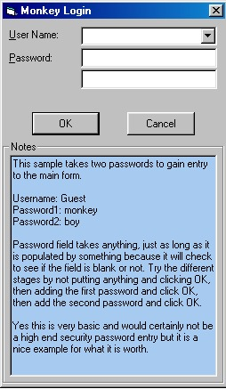

<div align="center">

## password examples


</div>

### Description

This code shows three different samples of using low security password entry to a form. Yes this is quick, easy and some might think somewhat lame but for beginners these samples will be just fine and useful. It keeps prying eyes out of my stuff anyways. These code examples can easily be modified for more sophisticated routines. It just lays a basic foundation is all.
 
### More Info
 
'Just change the passwords to whatever you want

'N/A

'No side effects


<span>             |<span>
---                |---
**Submitted On**   |
**By**             |[Steve G](https://github.com/Planet-Source-Code/PSCIndex/blob/master/ByAuthor/steve-g.md)
**Level**          |Intermediate
**User Rating**    |4.0 (8 globes from 2 users)
**Compatibility**  |VB 6\.0
**Category**       |[Custom Controls/ Forms/  Menus](https://github.com/Planet-Source-Code/PSCIndex/blob/master/ByCategory/custom-controls-forms-menus__1-4.md)
**World**          |[Visual Basic](https://github.com/Planet-Source-Code/PSCIndex/blob/master/ByWorld/visual-basic.md)
**Archive File**   |[](https://github.com/Planet-Source-Code/steve-g-password-examples__1-12799/archive/master.zip)

### API Declarations

```
'None
```


### Source Code

```
'This is just one of the examples showing a
'low security way to hard code form entry with
'a username and double password entry to the form.
'
'
'
Option Explicit
Public LoginSucceeded As Boolean
Private Sub Form_Load()
  Me.Caption = "Monkey Login "
End Sub
Private Sub cmdCancel_Click()
  LoginSucceeded = False
  Unload Me
End Sub
Private Sub cmdOK_Click()
Dim Pw1 As String '
Pw1 = "monkey" 'first password
'check combo box for population. If nothing
'return a msgbox dialog
If cmoUserName = "" Then
  MsgBox ("Type a Username")
Else
'Then check for first password
If txtPassword = Pw1 Then
'If correct password found go to verify second
Password2
End If
End If
End Sub
Private Function Password2()
Dim PW2 As String '
PW2 = "boy" 'second password
'check validity of second password
'then check if all correct, if so, load form
If txtPassword2 = PW2 Then
  LoginSucceeded = True
  MsgBox ("Access granted!")
  frmAbout.Show
  Unload Me
Else
'if only one password is correct and other empty
'remind user two passwords are needed
  MsgBox "You need both passwords to enter this program"
End If
End Function
```

